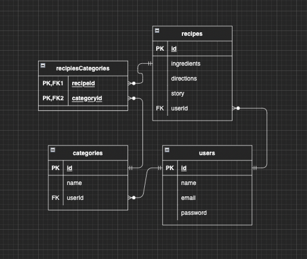
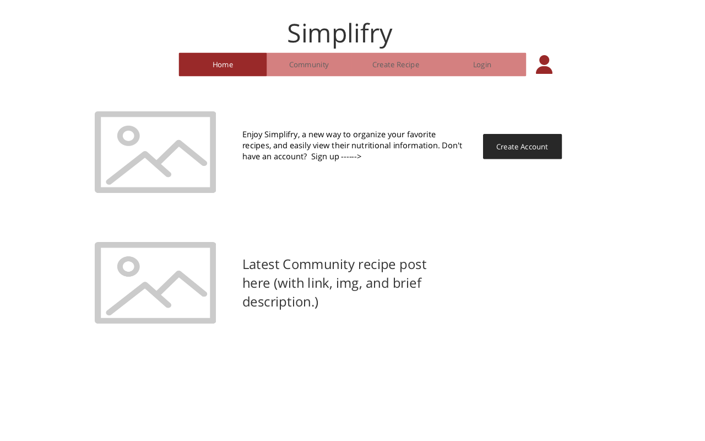
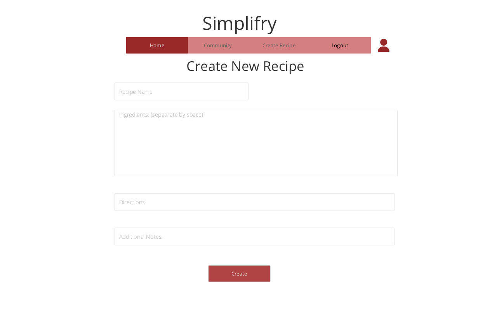
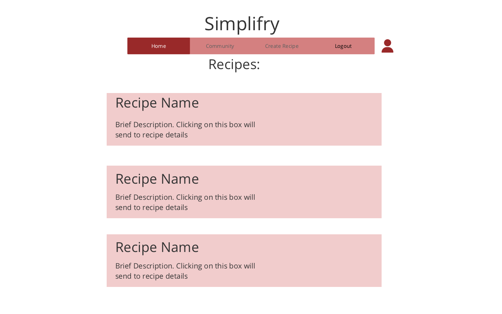
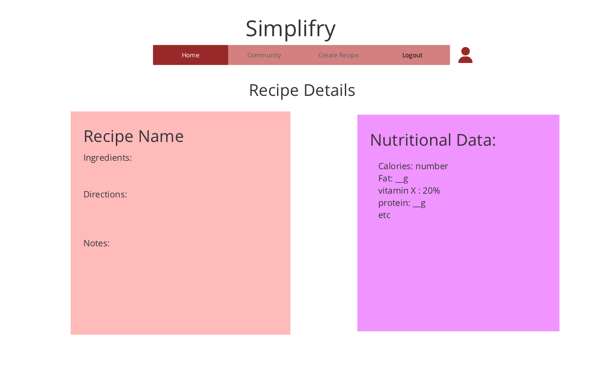
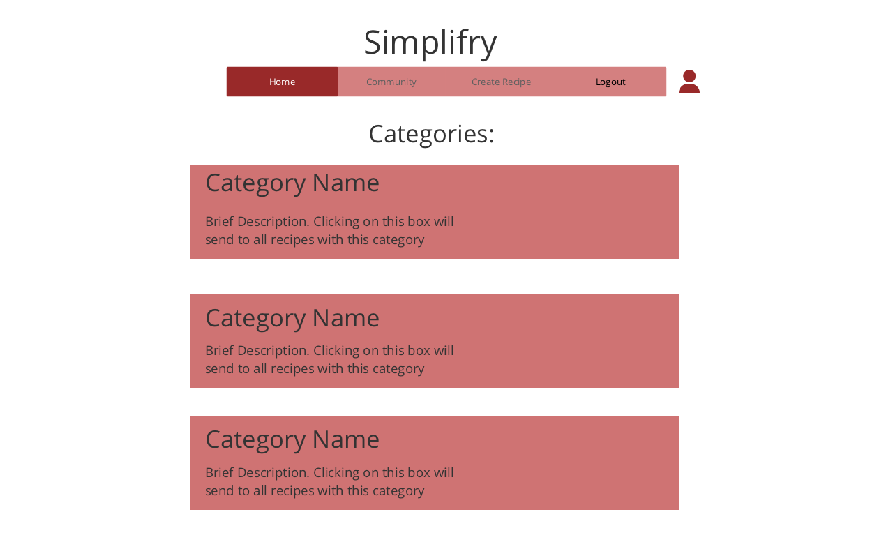

# Simplifry
## Simplify cooking. All recipes and nutritional data at once . 
Deployed Link: https://simplifry.herokuapp.com/

Simplifry is the best Sous Chef around! Conveniently organize all of your recipes  with useful nutritional information. 

## Description 
Simplifry is a website where users can store recipes. Once an account is created, users can add recipes to their account where they input the ingredients, directions, and any additional information. Nutritional data from the recipes will automatically be displayed. Users can create categories, and assign their recipes to categories for better organization. 
## API 
Edamam Food Database API https://developer.edamam.com/food-database-api-docs

Example: GET for "apple" : 
```
https://api.edamam.com/api/food-database/v2/parser?app_id=#####&app_key=#####ingr=apple
```
Using the information from the apple search, we can get the nutritional information for 1 ounce of Apple by POSTing:
```
https://api.edamam.com/api/food-database/v2/nutrients?app_id=#####&app_key=#####
```
and passing from the body: 
```
{
  "ingredients": [
    {
      "quantity": 1,
      "measureURI": "http://www.edamam.com/ontologies/edamam.owl#Measure_ounce",
      "foodId": "food_a1gb9ubb72c7snbuxr3weagwv0dd"
    }
  ]
}
```
Quanitity supplied by user, MeasureURI depends on the unit of measurement (supplied by user), and food Id comes from the above initial GET search

Note: this API is not restrictive (100 searches per minute, more than enough)

### EDIT: May use Edamam Nutrition Analysis API instead: 
Using the Nutritional Analysis API from Edamam, can just POST : 
```
https://api.edamam.com/api/nutrition-details?app_id=#####&app_key=#####
```
And pass relevant information through the body in the object : 
```
{
  "title": "string",
  "ingr": [
    "string"
  ],
  "url": "string",
  "summary": "string",
  "yield": "string",
  "time": "string",
  "img": "string",
  "prep": "string"
}
```
However, this api is more restrictive (only 400 recipes total per month for free plan)


## ERD 


## RESTful Routing Chart
### Users
| VERB | URL pattern | Action \(CRUD\) | Description |
| :--- | :--- | :--- | :--- |
| GET | / | Index \(Read\)   | Website Description, links to login or create account |
| GET | /users/login | Show \(Read\)  | shows a form to login |
| GET | /users/new | New \(Read\) | shows a form to create new account |
| POST | /users | Create \(Create\) | creates a user with the POST payload\(form\) data |
| POST | /users/login | show \(Read\) | send user a cookie with userId encrypted |
| GET | /users/logout |  | clears the userId cookie |


### Recipes
| VERB | URL pattern | Action \(CRUD\) | Description |
| :--- | :--- | :--- | :--- |
| GET | /recipes | Index \(Read\) | lists all of a user's recipes |
| GET | /recipes/new | New \(Read\) | shows a form to make a new recipe |
| POST | /recipes/new | Create \(Create\) | creates an recipe with the POST payload\(form\) data |
| GET | /recipes/:id | Show \(Read\) | list information about a specific recipe \(i.e. /recipes/1\) |
| GET | /recipes/edit/:id | Edit \(Read\) | shows a form for editting a specific recipe \(i.e. /recipes/edit/1\) |
| PUT | /recipes/:id | Update \(Update\) | updates the data for a specific recipe \(i.e. /recipes/1\) |
| DELETE | /recipes/:id | Destroy \(Delete\) | deletes the recipe with the specified id \(i.e. /recipes/1\) |


RESTful CRUD for Categories
| VERB | URL pattern | Action \(CRUD\) | Description |
| :--- | :--- | :--- | :--- |
| GET | /categories | Index \(Read\) | lists all of a user's categories |
| GET | /categories/new | New \(Read\) | shows a form to make a new category |
| POST | /categories/new | Create \(Create\) | creates a category with the POST payload\(form\) data |
| GET | /categories/:id/recipes | Show \(Read\) | shows all of a category's associated recipes (add association when recipe is created)|                          
| GET | /categories/edit/:id | Edit \(Read\) | shows a form for editting a specific category\(i.e. /categories/edit/1\) |
| PUT | /categories/:id | Update \(Update\) | updates the data for a specific category \(i.e. /category/1\) |
| DELETE | /categories/:id | Destroy \(Delete\) | deletes the category with the specified id. \(i.e. /categories/1\) |
## WireFrames





## User Stories

* User Story 1: As a user, I can sign in and out of an account that will store recipes and categories unique to my account. I will need to input a password to access my data. 
* User Story 2: As a user, I can input my recipe onto a form. I will input recipe name, ingredients, directions, story (optional), recommendations (optional). 
* User Story 3: As a user, I can create categories for my recipes with a name (i.e. 'Quick Breakfasts' or 'Post-workout' or 'Smoothies')    
* Note: A recipe can belong to many categories. Categories can have many recipes. 
* User Story 4: As a user, I will be able to add existing recipes to categories. I will also be able to change a recipe's category. 
* User Story 5: As a user, I can get access my recipes and their associated data. I will also get a detailed breakdown of the nutritional content of the recipe. 
* User Story 6: As a user, I can edit/delete categories and recipes from my profile. 

## GOALS 

### MVP 
1. User can log in and out of an account that will store their recipes, categories, and associations between recipes and categories. 
2. User can create recipes. Recipes will have a name, ingredients, step-by-step directions, story (optional), recommendations (optional). 
3. Categories can be created, and recipes can be added to or removed from categories.
4. Saved recipes can be displayed. A user will be able to view all of their recipes on one page, or they can view the recipes by category. In either case, clicking on a category will send the user to a details page where they can see all the recipe details. 
5. In addition to recipe details, call on the Edamam food database api https://developer.edamam.com/food-database-api-docs to access food nutritional data and provide a report on the recipe's nutritional value. 
6. Recipes, categories can be edited or deleted. 
### Stretch
1. Allow user to filter their recipes for certain ingredients (say if they have chicken and rice in stock, they can find recipes with chicken and rice.)

2. Add the abililty to post your favorite recipes to a hub where any user can post and comment 


